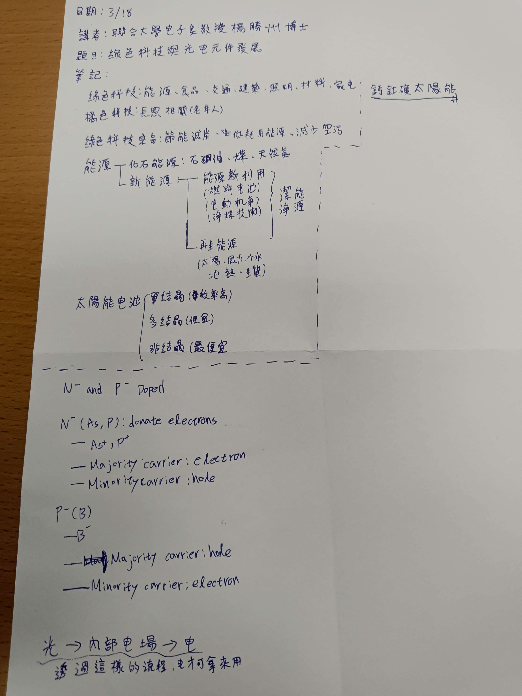
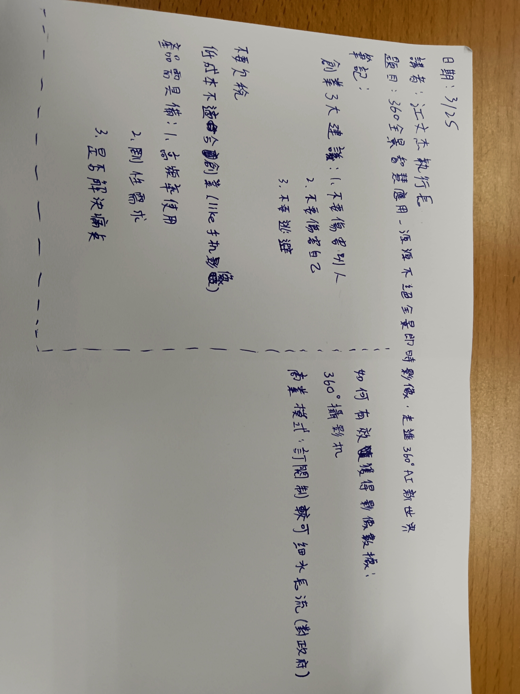
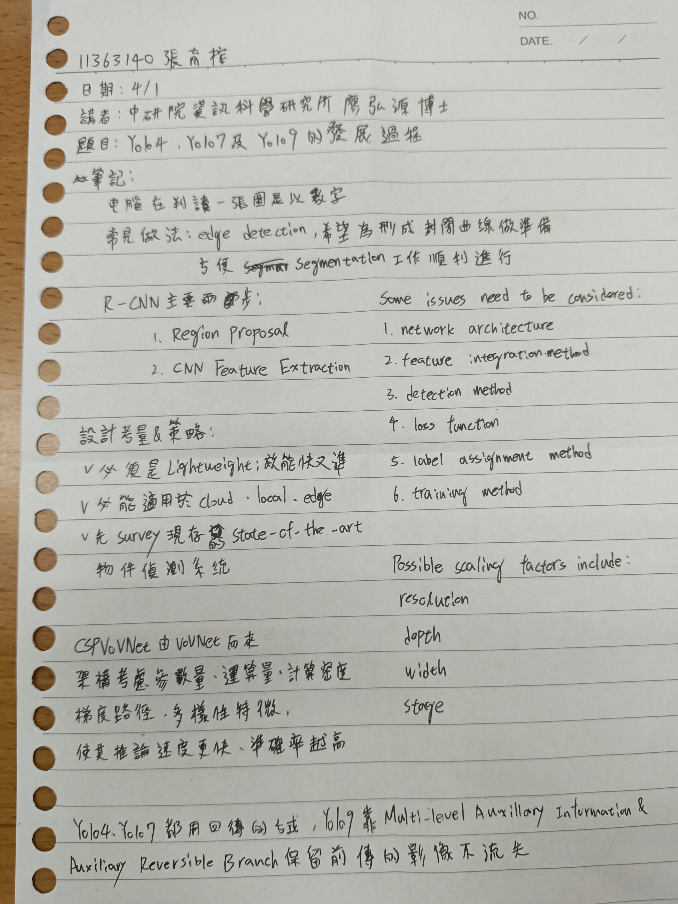
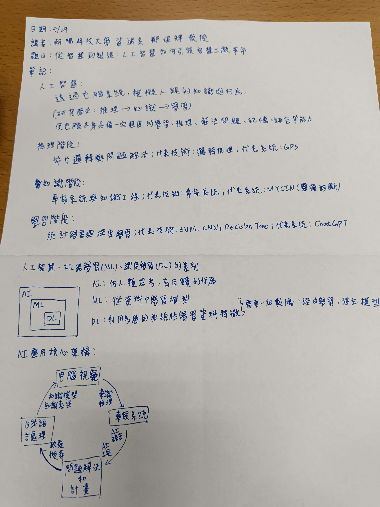

<header>

<!--
  <<< Author notes: Course header >>>
  Include a 1280×640 image, course title in sentence case, and a concise description in emphasis.
  In your repository settings: enable template repository, add your 1280×640 social image, auto delete head branches.
  Add your open source license, GitHub uses MIT license.
-->

# 書報討論(二) 報告專區

11363140張育榕

## 上課筆記
3/18:

3/25

4/1

4/22

4/29  
  
## 書面報告
日期:4/22  
講者:國立台北商業大學創新設計與經營學院 彭勝龍院長  
題目:The Complexity of strong conflict-free vertex-connection k-colorability  
心得報告:  
這次的演講提到了研究的本質與方法，像是研究的真正意義是在解決問題的過程，而不僅僅是研究的結果。彭院長將解決問題的科學方法分為觀察、認出、定義、假設、預測跟實驗等6種，他強調理論與實務並重，尤其在撰寫論文時，須在提出問題或解決問題的過程中適時運用數學公式，這能使論文顯得更加專業，院長也分享了如何選題、如何進行文獻調查、如何提出創新解決方案，以及如何在研究中保持耐心與熱情。他提醒我們要相信自己具備研究的能力，只要勇敢開始，就能逐步完成目標。雖然在院長開始講著色問題演算法的時候，我實在是沒有辦法去理解那個的好玩之處，探討如何為圖中的點或邊進行著色，使得任意兩點之間都存在一條「衝突自由（conflict-free）」的路徑，也就是路徑上有某個顏色只出現一次，我事後吵了PPT中的論文來看也是沒辦法搞懂為什麼，可能是我對演算法真的沒興趣，也可能是我邏輯不好聽的頭很痛，但在其他方面院長的演講確實給了我一點繼續走在研究這條路上的信心。  
關鍵字:  
研究方法、假設與實驗、學術寫作、無衝突頂點連接  
參考文獻:  
J. Czap, S. Jendrol. J. Valiska. (2018). Conflict-free connections of graphs. Discuss. Math. Graph Theory 38(4): 911-920.  
X. Li, Y. Zhang, X. Zhu, Y. Mao, H. Zhao, S. Jendrol. (2020). Conflict-free vertex-connections of graphs. Discuss. Math. Graph Theory 40(1): 51-65.  

</header>

<!--
  <<< Author notes: Step 1 >>>
  Choose 3-5 steps for your course.
  The first step is always the hardest, so pick something easy!
  Link to docs.github.com for further explanations.
  Encourage users to open new tabs for steps!
-->

